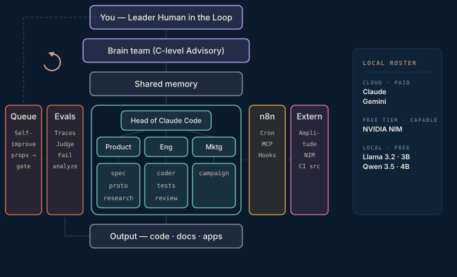
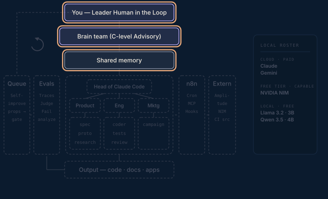

# Agentic Loop Build Up

**A blueprint you can build — the AI operating system you can stand up yourself.**

Eight phases, one job each, built in order, inside-out. This repository is the companion to the essay series: it holds the working attachments each post refers to — scripts, system-prompt templates, protocols, and workflows — organised by the phase they belong to.

<p align="center">
  
</p>

## Why the repository exists

The posts describe how to build an AI company operating system one layer at a time. Several of those layers ship with real files — an Apps Script router, a sync protocol, sample prompts, n8n workflows. Those files do not attach cleanly to the posts, so they live here instead, and each post links to the copy in the matching phase folder.

## How it is organised

Each phase gets its own folder. A folder holds that phase's attachments and a short README describing what the phase does and what is inside. The diagram at the top of every phase README lights up the components that come alive in that phase — read down the list and you watch the system assemble itself.

```
agentic-loop-build-up/
├── assets/diagrams/            # the architecture map, whole and per phase
├── phase-1-foundation/         # brain team & shared memory   (attachments live here)
├── phase-2-executive-seed/
├── phase-3-automation-seed/
├── phase-4-full-executive-team/
├── phase-5-request-bus/
├── phase-6-evals-observability/
├── phase-7-self-improvement-loop/
└── phase-8-external-platforms/
```

## The build order

The order is the point. The inside is proven before anything external is bolted on, because every outside integration is an account, a credential, a rate limit, and a failure mode you do not own. Prove the inside first, make it measurable, close the improvement loop, and only then point the machine at the outside world.

---

### Phase 1 · Foundation — brain team & shared memory



A group of C-level advisors — finance, product, engineering, marketing, whatever the venture needs — sharing markdown context through cloud sync. The thinking layer, already alive.

**Done when** you have created the advisory members and the team sync protocol runs between them.
**Attachments:** [`phase-1-foundation/`](phase-1-foundation/)

---

### Phase 2 · Executive seed


Claude Code on the exec laptop, pointed at the cloud sync. A charter file for the Head of Claude Code, no custom agents yet — just the basic brief-in / work-out loop.

**Done when** a file-based brief comes back as a correct deliverable, from Head of Claude Code to the brain team, without a human touching the terminal mid-task.
**Attachments:** [`phase-2-executive-seed/`](phase-2-executive-seed/)

---

### Phase 3 · Automation seed


The smallest possible n8n workflow — a chat that round-trips through the NVIDIA NIM API. This part is not about the model; it proves credentials, the HTTP node, and the call pattern.

**Done when** a message to a webhook comes back with a model's reply. The automation wing exists.
**Attachments:** [`phase-3-automation-seed/`](phase-3-automation-seed/)

---

### Phase 4 · Full executive team


One orchestrator, three heads — Product, Engineering, Marketing — and their sub-agents. Agent-to-agent communication is proven on its own, before any integration enters.

**Done when** a single brief produces a spec, a prototype, and reviewed code with no manual relay.
**Attachments:** [`phase-4-full-executive-team/`](phase-4-full-executive-team/)

---

### Phase 5 · The request bus


Connect the wings. One head, one tool, prove the link — then widen. Async flows ride the cloud sync folder in and out until the job to be done is done.

**Done when** an exec agent can ask an external model mid-task, and a file dropped in `outbox/` comes back transformed in `inbox/` untouched by the human in the loop.
**Attachments:** [`phase-5-request-bus/`](phase-5-request-bus/)

---

### Phase 6 · Evals & observability


Stop flying blind. Local open-source tracing on every run, and a mid-tier judge that scores outputs against rubrics calibrated by hand against roughly fifty real outputs.

**Done when** every run is traced and scored, failures land in a reviewable list, and the judge agrees with your own labelling.
**Attachments:** [`phase-6-evals-observability/`](phase-6-evals-observability/)

---

### Phase 7 · Self-improvement loop


Eval findings become proposals — prompt edits, rubric changes, model-tier promotions — queued for the human in the loop. Fifteen to thirty minutes of morning review.

**Done when** the system improves itself once with your approval, and the daily review of traces and proposals becomes a habit.
**Attachments:** [`phase-7-self-improvement-loop/`](phase-7-self-improvement-loop/)

---

### Phase 8 · External platforms — last


Analytics, ad optimisers, video and email APIs. Last, because by now the improvement loop is sharpening everything daily — and this is the messiest surface.

**Done when** a customer-signal digest is waiting for you on a Monday morning without anyone having asked for it. Full picture reached.
**Attachments:** [`phase-8-external-platforms/`](phase-8-external-platforms/)

---

Written by **Tuğra Sahiner** · [tugrasahiner.com](https://tugrasahiner.com) · CPO — AI, Tech, Product Strategy · Founder
