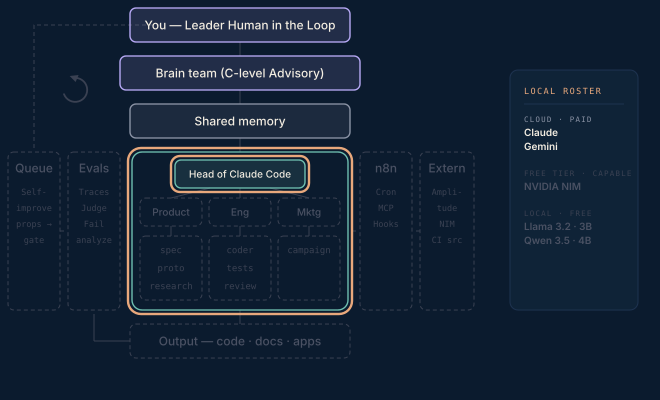

# Phase 2 · Executive seed

Claude Code on the exec laptop, pointed at the cloud sync. A charter file for the Head of Claude Code, no custom agents yet — just the basic brief-in / work-out loop. Get comfortable with the substrate before building the org on it.

**Done when** a file-based brief comes back as a correct deliverable, from Head of Claude Code to the brain team, without a human touching the terminal mid-task.

## Attachments

The attachments for this phase land here when its post ships — scripts, prompts, protocols, and workflows referenced in the write-up. Until then this folder is a placeholder that keeps the build order visible.
