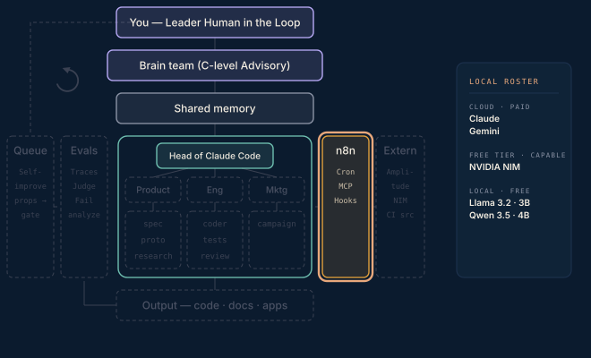

# Phase 3 · Automation seed

The smallest possible n8n workflow — a chat that round-trips through the NVIDIA NIM API. This part is not about the model; it proves credentials, the HTTP node, and the call pattern. Pick a popular model: free-tier queue counters are a global load gauge, and obscure models sit cold and time out.

**Done when** a message to a webhook comes back with a model's reply. The automation wing exists.

## Attachments

The attachments for this phase land here when its post ships — scripts, prompts, protocols, and workflows referenced in the write-up. Until then this folder is a placeholder that keeps the build order visible.
