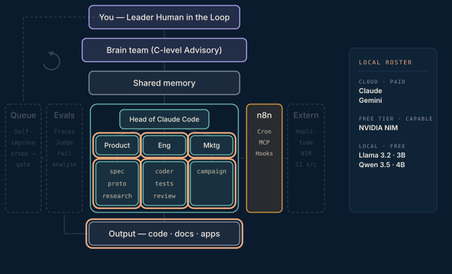

# Phase 4 · Full executive team

One orchestrator, three heads — Product, Engineering, Marketing — and their sub-agents. Prove agent-to-agent communication works on its own, before any integration enters. Watch for delegation loops or dropped context, and tune two or three prompts based on what you observe.

**Done when** a single brief produces a spec, a prototype, and reviewed code with no manual relay — it starts as a discussion with the brain team and finishes inside the internal comms.

## Attachments

The attachments for this phase land here when its post ships — scripts, prompts, protocols, and workflows referenced in the write-up. Until then this folder is a placeholder that keeps the build order visible.
