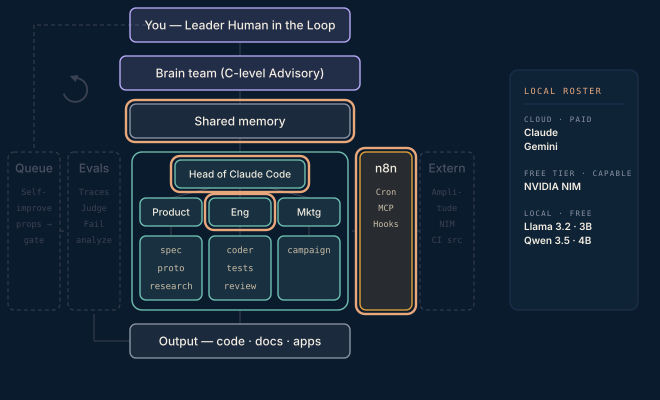

# Phase 5 · The request bus

Connect the wings. One head, one tool, prove the link — then widen. Expose the NIM chat as an MCP tool a head can call mid-task; run the reverse direction as an n8n Drive trigger that transforms files; then put LiteLLM in front so model choice becomes config. Async flows ride the cloud sync folder in and out until the job to be done is done.

**Done when** an exec agent can ask an external model mid-task, and a file dropped in `outbox/` comes back transformed in `inbox/` untouched by the human in the loop.

## Attachments

The attachments for this phase land here when its post ships — scripts, prompts, protocols, and workflows referenced in the write-up. Until then this folder is a placeholder that keeps the build order visible.
