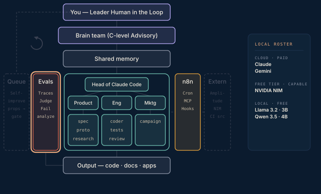

# Phase 6 · Evals & observability

Stop flying blind. Local open-source tracing on every run, and a mid-tier judge that scores outputs against rubrics you calibrate by hand against roughly fifty real outputs. This is the phase most people skip because it is not fun. It is the real product work — every failure starts a golden set, and each one becomes a test case.

**Done when** every run is traced and scored, failures land in a reviewable list, and the judge agrees with your own labelling.

## Attachments

The attachments for this phase land here when its post ships — scripts, prompts, protocols, and workflows referenced in the write-up. Until then this folder is a placeholder that keeps the build order visible.
