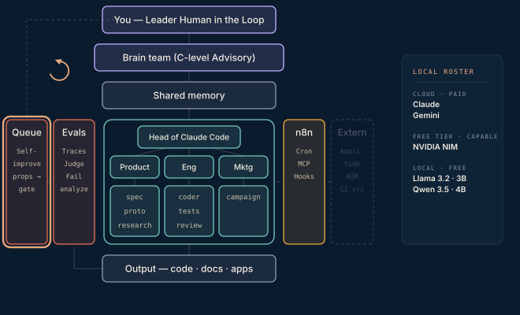

# Phase 7 · Self-improvement loop

Eval findings become proposals — prompt edits, rubric changes, model-tier promotions — queued for the human in the loop, each in the form finding → evidence → proposed edit → expected metric change. n8n turns recurring judge failures into queued proposals in a Drive file. Fifteen to thirty minutes of morning review.

**Done when** the system improves itself once with your approval, and the daily review of traces and proposals becomes a habit.

## Attachments

The attachments for this phase land here when its post ships — scripts, prompts, protocols, and workflows referenced in the write-up. Until then this folder is a placeholder that keeps the build order visible.
