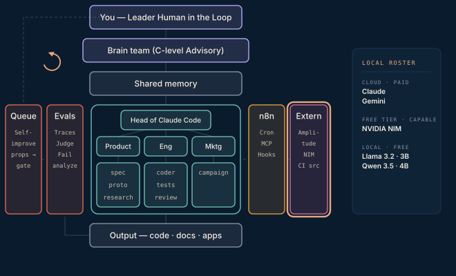

# Phase 8 · External platforms — last

Analytics, ad optimisers, video and email APIs. Last, because by now the improvement loop is sharpening everything daily — and this is the messiest surface. A weekly cron pulls reviews and tickets through NIM theme extraction into discovery; a marketing loop rides outbox → n8n → Amplitude → results brief → inbox.

**Done when** a customer-signal digest is waiting for you on a Monday morning without anyone having asked for it. Full picture reached.

## Attachments

The attachments for this phase land here when its post ships — scripts, prompts, protocols, and workflows referenced in the write-up. Until then this folder is a placeholder that keeps the build order visible.
